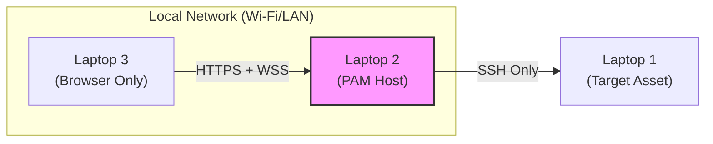
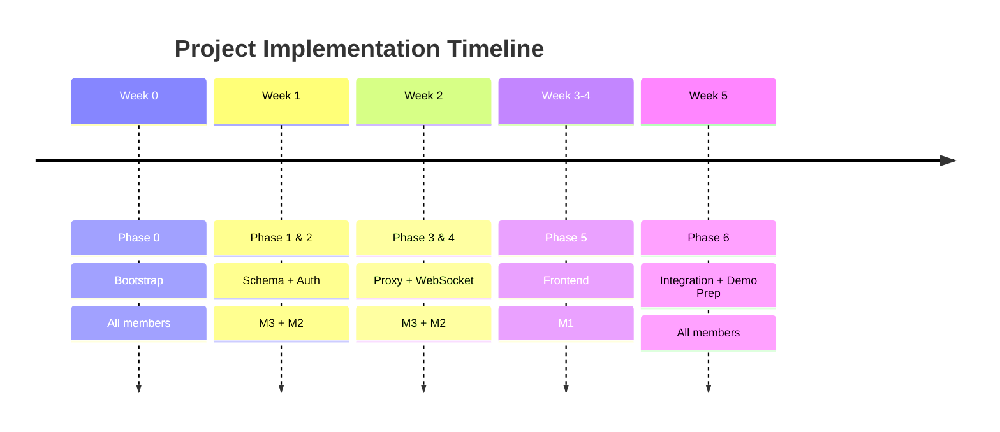

# SecureGate PAM — Project Plan


> [!abstract] What Is SecureGate?
> SecureGate is a **Privileged Access Management (PAM)** system. Think of it as a security checkpoint — like a bouncer at a club. You cannot walk straight into the venue (the target server). You must go through the bouncer (SecureGate), show your ID (authenticate), get a wristband (session ticket), and only then are you let in — with someone watching everything you do while you are inside.
>
> **Every keystroke. Every command. Every second. Logged.**

---

## Table of Contents

- [[#1. The Big Picture]]
- [[#2. Physical Setup — Three Laptops]]
- [[#3. Team Structure & Domain Ownership]]
- [[#4. The Technology Stack]]
- [[#5. Repository Layout]]
- [[#6. Project Phases — Overview]]
- [[#7. Phase 0 — Bootstrap (Day 1, All Members)]]
- [[#8. Phase 1 — Database Schema & Vault (Member 3)]]
- [[#9. Phase 2 — Authentication & RBAC (Member 2)]]
- [[#10. Phase 3 — SSH Proxy Engine (Member 3)]]
- [[#11. Phase 4 — WebSocket Server & Audit Pipeline (Member 2)]]
- [[#12. Phase 5 — Frontend (Member 1)]]
- [[#13. Phase 6 — Integration & Security Testing (All)]]
- [[#14. Full Session Lifecycle — Step by Step]]
- [[#15. Database Design Explained]]
- [[#16. Security Principles & Why They Matter]]
- [[#17. Demo Day Plan]]
- [[#18. Timeline]]

---

## 1. The Big Picture

### What Problem Are We Solving?

In real organisations, sensitive servers (databases, production machines, financial systems) cannot be accessed directly by employees. If anyone with a password can just SSH into a database server, there is no accountability — you cannot tell who ran what command, when, or why. If credentials are stored in a spreadsheet or someone's notes app, they can be stolen.

SecureGate solves this by sitting **in the middle** of every connection. The operator never gets the server's real password. They never connect directly to the server. They go through us.

### The Core Value Proposition

```
WITHOUT SecureGate:
  Employee → (knows password) → directly SSHes into database → does anything → no record

WITH SecureGate:
  Employee → proves identity → requests timed access → gets watched the whole time
           → every command captured → session can be replayed later → access auto-expires
```

### What Makes This a PAM System?

A PAM system has four jobs. SecureGate does all four:

| PAM Pillar | What It Means | How SecureGate Does It |
|---|---|---|
| **Authentication** | Prove you are who you say you are | JWT login with bcrypt password hashing |
| **Authorisation** | Prove you are allowed to do this | RBAC — role-based access policies per asset |
| **Access Control** | Limit when and how long access lasts | Redis JIT tickets with 60-second window + session TTL |
| **Audit** | Record everything that happened | MongoDB keystroke log, session replay |

---

## 2. Physical Setup — Three Laptops

This is a live, three-machine demonstration on a local network. No cloud. No simulation. Real traffic, real machines, real SSH.

### Network Diagram



![[NetworkDiagram.png]]

### Why This Specific Layout?

> [!info] The Point of Three Separate Machines
> The separation is not for convenience — it is the **security model itself**.
>
> - **Laptop 3** is the operator's machine. It is considered untrusted. It cannot reach Laptop 1 directly — UFW firewall rules block it at the network level.
> - **Laptop 2** is the only trusted intermediary. It holds the Master Key, decrypts credentials in memory only, and controls every byte of traffic.
> - **Laptop 1** is the protected asset. It accepts SSH connections from exactly one IP address — Laptop 2's. No exceptions.
>
> Even if someone on Laptop 3 somehow got the SSH password, they could not use it — they have no network path to Laptop 1.

### Machine Roles Summary

| Machine | IP Address | Role | Who Configures |
|---|---|---|---|
| Laptop 1 | `192.168.1.20` | Target Asset — SSH, MySQL, MongoDB | Member 3 |
| Laptop 2 | `192.168.1.10` | PAM Host — entire Docker Compose stack | All (owned by Member 3) |
| Laptop 3 | DHCP | Client — browser only, no server software | Member 1 (frontend) |

---

## 3. Team Structure & Domain Ownership

### The Golden Rule

> [!warning] Domain Boundaries Are Absolute
> This project is a single Next.js monorepo. Even though all three members work in the same repository, they own distinct directories within it. Think of it like three departments in a company — Finance does not rewrite HR's database, and Engineering does not change Finance's spreadsheets without permission.
>
> If your work needs to cross into another member's directory, you **discuss it first, define an interface together, and code to that interface** — you do not reach in and change the other person's files.

### Who Owns What

```python
┌─────────────────────────────────────────────────────────────────────────────┐
│                          SecureGate Domains                                 │
│                         (single Next.js repo)                               │
│                                                                             │
│  ┌──────────────────────┐  ┌──────────────────────┐  ┌──────────────────┐  │
│  │     MEMBER 1         │  │     MEMBER 2         │  │    MEMBER 3      │  │
│  │  UI/UX & Terminal    │  │  API & WebSocket     │  │  Vault & Infra   │  │
│  │       Lead           │  │       Lead           │  │     Lead         │  │
│  │                      │  │                      │  │                  │  │
│  │  /app                │  │  /app/api/           │  │  /lib/vault/     │  │
│  │  /components         │  │  server.ts           │  │  /docker         │  │
│  │                      │  │                      │  │                  │  │
│  │  • Login page        │  │  • Auth API routes   │  │  • Docker setup  │  │
│  │  • Dashboard         │  │  • RBAC logic        │  │  • PostgreSQL    │  │
│  │  • xterm.js terminal │  │  • Session tickets   │  │    schema        │  │
│  │  • Session countdown │  │  • WebSocket gateway │  │  • AES-256-GCM   │  │
│  │  • Replay player     │  │  • Audit pipeline    │  │    encryption    │  │
│  │                      │  │  • MongoDB writes    │  │  • SSH tunnels   │  │
│  │                      │  │                      │  │  • Laptop 1 prep │  │
│  └──────────────────────┘  └──────────────────────┘  └──────────────────┘  │
│                                       │                                     │
│                             ┌─────────┴──────────┐                         │
│                             │   /lib/shared/      │                         │
│                             │  (all members,      │                         │
│                             │   consensus only)   │                         │
│                             │                     │                         │
│                             │  • TypeScript DTOs  │                         │
│                             │  • Interface types  │                         │
│                             │  • Role enums       │                         │
│                             └─────────────────────┘                         │
└─────────────────────────────────────────────────────────────────────────────┘
```

### Interaction Points — Where Domains Meet

The three domains interact at exactly three defined points. These are the only places where one member's code calls another's:

**Point A — Member 2 calls Member 3's VaultService**
When the WebSocket gateway in `server.ts` needs to open an SSH tunnel, it calls `vaultService.openTunnel()`. Member 2 does not know how the tunnel works internally — that is Member 3's concern. Member 2 just calls the function and gets back a stream.

**Point B — Member 1 calls Member 2's REST API**
The frontend calls `/api/auth/login`, `/api/assets`, `/api/sessions/request`, and `/api/audit/sessions`. The shape of these responses is agreed in `/lib/shared/` and cannot change without a team discussion.

**Point C — Member 1 connects to Member 2's WebSocket**
The terminal page opens a WebSocket to the custom `server.ts` gateway. The events (`terminal:data`, `terminal:resize`, `session:expired`) are defined in `/lib/shared/` and agreed by both members.

---

## 4. The Technology Stack

### Why This Stack?

This project is built for a web technologies course that specifies the **MERN stack** (MongoDB, Express, React, Node.js). We respect that constraint while adding the security layers a PAM system needs. The architecture uses a **single Next.js monorepo** — the framework handles both the UI (React, App Router) and the REST API (`app/api/` route handlers). Because Next.js API routes are serverless by design and do not support long-lived WebSocket connections natively, we attach a **custom Node.js HTTP server (`server.ts`)** to the Next.js application at startup. This custom server is where the WebSocket gateway and SSH tunnel lifecycle live, sharing the same process and port as the Next.js app.

> [!example] Analogy — The Stack as a Restaurant
> Think of the application like a restaurant:
> - **Next.js `/app` (frontend)** is the dining room and menu — what the customer sees and interacts with
> - **Next.js `/app/api/` (REST API)** is the head waiter — takes orders, checks reservations, enforces the rules
> - **`server.ts` (custom Node.js server)** is the kitchen intercom — a persistent channel the head waiter cannot handle alone, kept alive for the whole service
> - **PostgreSQL** is the filing cabinet in the office — structured records of who is allowed what
> - **MongoDB** is the security camera recording — captures everything that happens, time-stamped
> - **Redis** is the cloakroom ticket — you get one, it is valid for a short time, then it is gone
> - **`/lib/vault/`** is the safe behind the manager's office — only the right key opens it
> - **Docker Compose** is the building itself — keeps every room in the right place, separated

### Stack Table

| Layer | Technology | Why This One |
|---|---|---|
| Frontend UI | **Next.js 14** (React, App Router, `/app`) | Single-framework requirement, SSR, edge middleware for route protection |
| REST API | **Next.js Route Handlers** (`/app/api/`) | Serverless API routes co-located with the UI in the same codebase |
| WebSocket server | **Custom Node.js `server.ts`** (attached to Next.js HTTP server) | Next.js route handlers are stateless; `server.ts` keeps a persistent socket.io server alive on the same port |
| Styling | **Tailwind CSS** | Course requirement, utility-first, fast to build with |
| Terminal | **xterm.js + FitAddon** | The only production-grade browser terminal emulator. Powers VS Code's terminal. |
| Frontend state | **Zustand** | Lightweight. Access token stored in memory (not localStorage) |
| Form handling | **React Hook Form + Zod** | Client-side validation before any API call is made |
| Auth | **jose + JWT RS256** | RS256 is asymmetric — public key can be shared without exposing the signing secret. `jose` works in both Edge Runtime (middleware) and Node.js (API routes) |
| Password hashing | **bcrypt (12 rounds)** | Industry standard. 12 rounds is the sweet spot of security vs performance |
| Relational DB | **PostgreSQL 16** | Users, roles, RBAC policies, encrypted credential blobs |
| Audit DB | **MongoDB 7** | Time-series keystroke logs. Flexible schema, fast bulk inserts |
| Session store | **Redis 7** | Sub-millisecond key lookup. TTL is a native feature. Atomic `GETDEL` |
| Encryption | **Node.js `crypto` (AES-256-GCM)** | Built-in. Authenticated encryption — detects tampering |
| SSH tunnelling | **ssh2 + node-pty** | Programmatic SSH client. node-pty manages the pseudo-terminal |
| Containers | **Docker Compose** | Isolated services, reproducible across all three laptops |

---

## 5. Repository Layout

### Folder Structure Explained

```java
/securegate                     ← Single Next.js monorepo root
│
├── server.ts                   ← MEMBER 2 — custom Node.js server
│                                  Bootstraps Next.js, attaches socket.io
│                                  WebSocket gateway and SSH tunnel lifecycle
│                                  Runs on port 3000 (replaces `next start`)
│
├── /app                        ← MEMBER 1 — UI pages (Next.js App Router)
│   ├── /login                  ← The authentication page
│   ├── /dashboard              ← Asset listing after login
│   ├── /terminal               ← Live terminal session
│   ├── /replay                 ← Audit session playback
│   └── middleware.ts           ← Route protection — redirects to /login if not authenticated
│
├── /app/api                    ← MEMBER 2 — REST API route handlers
│   ├── /auth
│   │   ├── login/route.ts      ← POST /api/auth/login — bcrypt verify, RS256 JWT
│   │   └── refresh/route.ts    ← POST /api/auth/refresh — httpOnly cookie handling
│   ├── /assets
│   │   └── route.ts            ← GET /api/assets — RBAC-filtered asset listing
│   ├── /sessions
│   │   ├── request/route.ts    ← POST /api/sessions/request — Redis JIT ticket
│   │   └── [id]/route.ts       ← DELETE /api/sessions/:id — admin revocation
│   └── /audit
│       ├── sessions/route.ts   ← GET /api/audit/sessions
│       └── sessions/[id]/events/route.ts ← GET /api/audit/sessions/:id/events
│
├── /components                 ← MEMBER 1 — reusable UI pieces
│   └── (TerminalPane, AssetCard, ReplayPlayer, etc.)
│
├── /store                      ← MEMBER 1 — Zustand state (tokens, session info)
│
├── /lib                        ← Shared server-side logic
│   ├── /vault                  ← MEMBER 3 — the crypto heart
│   │   ├── vault.service.ts    ← AES-256-GCM encrypt/decrypt
│   │   └── tunnel.service.ts   ← ssh2 tunnel lifecycle
│   ├── /shared                 ← ALL MEMBERS — change by consensus only
│   │   ├── /interfaces         ← TypeScript interfaces for cross-domain calls
│   │   └── /types              ← Shared enums (Role, EventType, etc.)
│   ├── auth.ts                 ← MEMBER 2 — JWT helpers (sign, verify with jose)
│   └── rbac.ts                 ← MEMBER 2 — role guard utilities
│
├── /docker                     ← MEMBER 3 — DB init scripts
├── docker-compose.yml          ← MEMBER 3 — defines all containers
├── .env.example                ← Committed — shows every variable name with explanation
├── .env                        ← GITIGNORED — real secrets, never committed
├── Makefile                    ← Simple commands: make up, make down, make logs
└── README.md
```

> [!info] Why `server.ts` and Not a Separate Service?
> Next.js API route handlers (files inside `/app/api/`) are designed to be short-lived and stateless — they handle one request and exit. A WebSocket connection, by contrast, must stay open for the entire duration of a terminal session (potentially 30+ minutes). You cannot hold a WebSocket open inside a Next.js route handler.
>
> The solution is a **custom Node.js server** (`server.ts`) that starts first, creates an HTTP server, attaches socket.io to it, and then hands all normal HTTP requests to Next.js. Everything runs on port 3000 — the WebSocket upgrade happens on the same port as the UI and the REST API. From the outside, it looks like one server.

### The `.env` File — Secret Management

> [!danger] The Most Important File in the Project
> The `.env` file contains the Master Encryption Key, database passwords, and JWT signing keys. It is **gitignored** — it must never appear in the git history, not even once.
>
> The `.env.example` file IS committed. It contains every variable name and a comment explaining what it does, but no real values. Any team member clones the repo, copies `.env.example` to `.env`, fills in values, and runs `make up`. Meaning it can be 
> ```python
> git add .env.example
> git commit 
> git push
> 
> ```

Every variable follows the naming convention `GUARDIAN_` to namespace them from any system variables:

- `GUARDIAN_MASTER_KEY` — the 32-byte hex key that encrypts all target server credentials
- `GUARDIAN_JWT_PRIVATE_KEY` — signs JWT tokens (RS256 private key)
- `GUARDIAN_JWT_PUBLIC_KEY` — verifies JWT tokens (can be shared publicly)
- `GUARDIAN_DB_PASS`, `GUARDIAN_REDIS_PASS` — database passwords
- `GUARDIAN_TARGET_HOST` — Laptop 1's static IP address

---

## 6. Project Phases — Overview



### Phase-by-Phase Summary

| Phase | Name | Owner | Output |
|---|---|---|---|
| 0 | Bootstrap | All | Running Docker stack, single Next.js skeleton with `server.ts`, shared git conventions |
| 1 | Database + Vault | Member 3 | PostgreSQL schema, AES-256-GCM encrypt/decrypt in `/lib/vault/`, seed data |
| 2 | Auth + RBAC | Member 2 | Login route handler, JWT issuance via `jose`, role guard utilities, asset listing |
| 3 | SSH Proxy Engine | Member 3 | ssh2 tunnel, PTY management, resize handling, VaultService API in `/lib/vault/` |
| 4 | WebSocket + Audit | Member 2 | Terminal gateway in `server.ts`, I/O pipe, MongoDB audit buffer |
| 5 | Frontend | Member 1 | Login UI, dashboard, xterm.js terminal, replay player in `/app` and `/components` |
| 6 | Integration + Testing | All | End-to-end tested, security validated, demo rehearsed |

---

## 7. Phase 0 — Bootstrap (Day 1, All Members)

### Purpose

Day 1 is the only day all three members work in the same space. The goal is to leave with a running (even if empty) Docker container serving the Next.js app, a shared git repository everyone can push to, and zero "it works on my machine" problems for the rest of the project.

### What Gets Done

**Member 3** writes the `docker-compose.yml` defining four services — `app`, `postgres`, `redis`, and `mongo` — all on an internal Docker bridge network called `guardian-net`. Only the Next.js app (port 3000) is exposed outside Docker. The databases are only reachable from inside `guardian-net` — this is a deliberate security boundary.

**Member 3** also writes the `Makefile` with four commands: `make up` (start everything), `make down` (stop everything), `make logs` (watch all logs), and `make seed` (load test data). Members 1 and 2 use only these four commands and never need to understand Docker internals.

**Member 3** configures Laptop 1 as the target server — installs OpenSSH, creates the `pamuser` account, hardens SSH configuration, sets firewall rules, seeds MySQL with fake employee data, and assigns static IP addresses to both Laptop 1 and Laptop 2.

**Member 2** runs `npx create-next-app@latest securegate --typescript --tailwind --app` to generate the single monorepo. Member 2 then creates `server.ts` at the project root — a minimal custom server that starts an HTTP server, attaches socket.io to it, and delegates all other requests to Next.js. At this stage `server.ts` only logs "WebSocket server ready" — no logic yet. Member 2 updates `package.json` so `npm run dev` and `npm start` both invoke `server.ts` rather than the default Next.js binary.

**Member 1** adds the `/app/login`, `/app/dashboard`, `/app/terminal`, and `/app/replay` directory stubs with placeholder pages. No UI yet — just pages that render "Coming soon" so the routing structure is agreed from day one.

**All members together** agree on:
- The `.env.example` variable names (every variable documented before any code uses it)
- The git branching convention (`feat/m1-*`, `feat/m2-*`, `feat/m3-*`)
- The `/lib/shared/` interface files (an empty folder, ready to receive TypeScript types)
- ESLint and Prettier config at the repo root — one code style, no arguments

> [!example] Why Bootstrap Day Matters
> Imagine building a three-lane bridge where each team builds one lane independently, then joins them together on the last day. If the lanes are different widths, the whole bridge fails at the joints. Bootstrap day is when you agree on the widths before anyone lays a single plank.

### Deliverables at End of Phase 0

- [ ] `make up` runs without errors on Laptop 2
- [ ] `http://192.168.1.10:3000` loads the Next.js placeholder from Laptop 3's browser
- [ ] `server.ts` starts successfully — "WebSocket server ready" appears in logs
- [ ] Laptop 1 responds to `ssh pamuser@192.168.1.20` from Laptop 2 only
- [ ] All three members can push to `dev` branch
- [ ] `.env.example` is complete and committed

---

## 8. Phase 1 — Database Schema & Vault (Member 3)

### Purpose

Before any API route handler is built, the data structures that power everything must exist. Phase 1 produces two things: the PostgreSQL schema that Member 2's API reads from, and the encryption module in `/lib/vault/` that protects target server credentials.

### The Database Design Philosophy

> [!info] Separation of Metadata and Secrets
> The most important design decision in the schema is splitting asset information across two tables.
>
> `target_assets` holds only **safe metadata** — the server name, hostname, and database type. This can be returned to the frontend without any security concern.
>
> `asset_credentials` holds only **encrypted blobs** — the ciphertext of the SSH username and password. It never holds plaintext. Even if someone extracts the entire database, they get binary noise without the Master Key.
>
> Think of it like a hotel key card system. The front desk has a board with room numbers on it (safe metadata, visible to staff). The safe in each room has a combination (secret). The board on the wall and the safe combination are kept completely separate.

### What Gets Stored Where

```
PostgreSQL Database
│
├── users                    Who can log into SecureGate
│   ├── id, email            Identifying info
│   └── password_hash        bcrypt hash ONLY — plaintext never stored
│
├── roles                    The named permission levels
│   └── ADMIN, OPERATOR, AUDITOR
│
├── user_roles               Which user has which role
│   └── (user_id, role_id)   Many-to-many join
│
├── target_assets            The servers we protect access to
│   ├── name, hostname, port  Safe to show on the dashboard
│   └── db_type               mysql or mongodb
│
├── access_policies          RBAC — who can access which server
│   ├── role_id → roles      The role that has access
│   ├── asset_id → assets    The asset they can access
│   └── max_session_seconds  How long they get (e.g. 1800 = 30 min)
│
└── asset_credentials        THE VAULT — encrypted blobs only
    ├── asset_id             Links back to target_assets
    ├── encrypted_blob       AES-256-GCM ciphertext
    ├── iv                   12-byte random nonce (unique per encryption)
    └── auth_tag             16-byte integrity proof
```

### The Vault — AES-256-GCM Encryption Explained

AES-256-GCM is **authenticated encryption**. It does two things simultaneously: encrypts the data (confidentiality) and produces a mathematical tag that proves the data has not been altered (integrity).

> [!example] Analogy — A Tamper-Evident Safe
> Regular encryption is like putting something in a box and locking it. Someone could potentially swap the locked box for a different locked box and you would not know.
>
> AES-256-GCM is like putting something in a box, locking it, and then shrink-wrapping the entire thing with a unique seal. If anyone tampers with the box — even changes one byte of the ciphertext in the database — the seal breaks, decryption fails, and the tunnel never opens. The `auth_tag` is that seal.

**The three values stored per credential:**
- `encrypted_blob` — the ciphertext (the actual SSH username/password, scrambled)
- `iv` — the Initialisation Vector, a 12-byte random number generated fresh for every encryption. Like a salt for a hash — ensures the same password encrypted twice looks completely different
- `auth_tag` — the 16-byte integrity tag. If the ciphertext is tampered with in the database, this check fails

**The Master Key** (`GUARDIAN_MASTER_KEY`) never enters the database. It is a 32-byte hex string that lives only in the `.env` file on Laptop 2's host filesystem, injected into the container as an environment variable. No Master Key → no decryption → no access, ever.

### The VaultService API — The Contract Between Members 2 and 3

Member 3 implements the vault internals in `/lib/vault/tunnel.service.ts`. Member 2 uses the vault through a clean interface agreed in `/lib/shared/`. Member 2 does not know how SSH connections work internally — that is Member 3's concern.

The five operations Member 3 exposes:

| Operation | When Called | What It Does |
|---|---|---|
| `openTunnel()` | Session starts | Decrypts credentials, establishes SSH connection, opens PTY |
| `write()` | Every keystroke | Sends data to the SSH stream |
| `resize()` | Browser window resizes | Tells the remote PTY its new dimensions |
| `onData()` | Session start | Registers a callback — called whenever SSH sends output |
| `closeTunnel()` | Session ends | Closes SSH connection, cleans up memory |

### Phase 1 Deliverables

- [ ] All six PostgreSQL tables created and migrated
- [ ] Seed data loaded — demo users, demo asset, policies configured
- [ ] AES-256-GCM encrypt and decrypt functions written and manually tested in `/lib/vault/vault.service.ts`
- [ ] VaultService interface committed to `/lib/shared/`

---

## 9. Phase 2 — Authentication & RBAC (Member 2)

### Purpose

Before any session can be started, before any asset can be listed, before any terminal opens — the user must prove who they are and the system must decide what they are allowed to do. Phase 2 builds the Next.js API route handlers and the supporting auth/RBAC utilities that every subsequent route depends on.

### Authentication Flow

```
User                    Frontend (/app)            API Route Handler           PostgreSQL
────                    ──────────────             ─────────────────           ──────────

Types email             Validates format
and password            with Zod (client-side)
                        before sending ─────────► POST /api/auth/login
                                                  
                                                  Look up user by email ──► SELECT user
                                                  ◄────────────────────── Return user row
                                                  
                                                  bcrypt.compare()
                                                  (password vs hash)
                                                  
                        ◄─ If wrong: 401 ─────── Generic "Invalid credentials"
                                                  (never reveals if email exists)
                        
                        ◄─ If correct: ──────────  Sign two JWTs with jose:
                           accessToken            • Access token (15 min)
                           + httpOnly cookie       • Refresh token (7 days, in cookie)
                           
Store accessToken
in memory (Zustand)
```

> [!info] Why Two Tokens?
> The **access token** is short-lived (15 minutes). It is what the frontend sends with every API request. If it is stolen somehow, it expires quickly.
>
> The **refresh token** lives in an `httpOnly` cookie (7 days). JavaScript on the page cannot read `httpOnly` cookies — this protects against XSS attacks stealing it. When the access token expires, the frontend silently calls `/api/auth/refresh`, the server reads the cookie and issues a new access token. The user never has to log in again for 7 days.
>
> This is the same pattern used by Google, GitHub, and virtually every serious web application.

### Why `jose` and Not Other JWT Libraries?

Next.js middleware (`middleware.ts`) runs in the **Edge Runtime** — a restricted, browser-like environment that does not have access to Node.js built-ins. Most JWT libraries depend on Node.js APIs and will throw errors at the edge. `jose` is built for the Web Crypto API, so it runs identically in Edge Runtime (middleware) and in Node.js (API route handlers). One library, one import, works everywhere in the codebase.

### Why RS256 and Not HS256?

JWT tokens can be signed two ways:

- **HS256** (symmetric) — one secret key, used to both sign and verify. Anyone who can verify tokens also has the power to create fake ones. The secret must be kept absolutely private.
- **RS256** (asymmetric) — a private key signs tokens, a public key verifies them. The public key can be shared freely. Only the server with the private key can create valid tokens.

For SecureGate, RS256 is the correct choice because it matches how real enterprise identity systems work. The public key is exposed at `/api/auth/.well-known/jwks.json` — this is the same pattern used by Auth0, Okta, and AWS Cognito.

### RBAC — Role-Based Access Control

The three roles and what they can do:

```
ADMIN
  ├── Login and view dashboard
  ├── See all assets
  ├── Request sessions on any asset
  ├── Revoke any active session
  ├── View all audit logs (all users)
  ├── Replay any session
  └── Add new target assets and users

OPERATOR
  ├── Login and view dashboard
  ├── See only assets their role has a policy for
  ├── Request sessions on those assets
  └── View their own session history only

AUDITOR
  ├── Login and view dashboard
  ├── View all audit logs (read-only)
  └── Replay any session
     (Cannot request sessions — auditors watch, not act)
```

> [!example] RBAC in Practice
> Imagine a company with three database servers: Production DB, Staging DB, and Analytics DB.
>
> The `access_policies` table might say:
> - ADMIN role → all three servers → 60 minutes max
> - OPERATOR role → Staging DB only → 30 minutes max
> - AUDITOR role → no servers (cannot request sessions)
>
> When an Operator logs in and calls `GET /api/assets`, the route handler joins their role against `access_policies` and returns only Staging DB. Production DB and Analytics DB are completely invisible to them — not hidden on the frontend, genuinely absent from the API response.

### The JIT Session Ticket

When an Operator clicks "Request Access" on an asset:

```
Operator clicks         API validates              Redis stores ticket
"Request Access"        role has policy ─────────► SETEX ticket:{uuid} 60s "{userId}:{assetId}"
                        for this asset
                        
                        ◄────────────────────────── Returns { ticket, expiresAt }
                        
Frontend navigates
to /terminal?ticket=<uuid>

WebSocket connects      GETDEL ticket:{uuid}  ────► Returns "{userId}:{assetId}" AND deletes it
with ticket             If null → reject           Ticket is now gone forever
                        If found → proceed
```

> [!info] Why 60 Seconds?
> The 60-second window between "ticket issued" and "WebSocket must connect" is intentionally tight. In real PAM systems this is called Just-In-Time (JIT) access. A ticket is not a persistent credential — it is a single-use token that expires almost immediately. If the WebSocket does not connect within 60 seconds, the user must request a new session. This prevents tickets from sitting around unused, being stolen and replayed later.

### Phase 2 Deliverables

- [ ] `POST /api/auth/login` issues valid RS256 JWT via `jose`
- [ ] `POST /api/auth/refresh` works with httpOnly cookie
- [ ] `GET /api/assets` returns correct assets filtered by role
- [ ] Role guard utility in `/lib/rbac.ts` blocks wrong roles with 403
- [ ] `POST /api/sessions/request` creates Redis ticket with 60s TTL
- [ ] All input validated — SQL injection blocked by input schema checks before DB

---

## 10. Phase 3 — SSH Proxy Engine (Member 3)

### Purpose

Phase 3 builds the most security-critical component: the piece that actually reaches through the PAM and touches the target server. Member 3 owns this entirely inside `/lib/vault/tunnel.service.ts`. Member 2 calls it through the VaultService interface.

### Why a Proxy and Not Direct Access?

> [!example] The CCTV Operator Analogy
> Imagine a CCTV monitoring room. The operator watching the cameras does not have physical access to the areas the cameras cover. They see a screen. Someone else manages the cameras. The operator cannot bypass the screen and walk into the secure area.
>
> xterm.js is the operator's screen. The WebSocket gateway in `server.ts` is the monitoring room. The SSH tunnel is the camera feed. Laptop 1 is the secure area. The operator types into xterm.js and thinks they are using a terminal — but every byte goes through three layers before it reaches Laptop 1, and a copy of every byte is written to MongoDB on the way through.

### The SSH Connection Lifecycle

```
Session starts
│
├─► 1. TICKET VALIDATED  (Member 2's gateway calls this first)
│       Redis GETDEL ticket:{uuid}
│       If null → reject connection immediately
│       If found → proceed with userId and assetId
│
├─► 2. CREDENTIALS DECRYPTED  (in-memory only)
│       Query asset_credentials from PostgreSQL
│       AES-256-GCM decrypt using Master Key
│       Result is a local variable containing { username, password }
│       It will be passed directly to ssh2 and then overwritten
│
├─► 3. SSH CONNECTION ESTABLISHED
│       ssh2 Client connects to 192.168.1.20 port 22
│       Uses decrypted username + password
│       Variable immediately overwritten — plaintext lives for milliseconds
│
├─► 4. PTY SHELL REQUESTED
│       Terminal dimensions (cols × rows) from xterm.js FitAddon
│       Shell opened with term: 'xterm-256color'
│       This is what makes the remote terminal behave like a real terminal
│
├─► 5. STREAM STORED IN MEMORY
│       Map<sessionId → SSHStream>
│       All subsequent write() calls find the stream here
│
└─► Session is now live
```

### The I/O Fork — The Core Security Feature

When data flows through the proxy, it is split:

```
KEYSTROKE from browser
        │
        ▼
WebSocket Gateway (server.ts — Member 2)
        │
        ├──────────────────────────────────────────► SSH Stream → Laptop 1
        │                                            (instant, not blocked)
        │
        └──────────────────────────────────────────► MongoDB Audit Buffer
                                                     (async, fire-and-forget)
                                                     (never blocks the proxy path)


STDOUT from Laptop 1
        │
        ▼
SSH Stream
        │
        ├──────────────────────────────────────────► WebSocket → browser xterm.js
        │                                            (instant)
        │
        └──────────────────────────────────────────► MongoDB Audit Buffer
                                                     (async, fire-and-forget)
```

> [!warning] The One Rule of the Audit Write
> The MongoDB write must **never block the proxy path**. If the database is slow, the terminal must still be fast. This is achieved using `setImmediate()` — it defers the DB write until after the current I/O cycle, so the SSH pipe never waits for it. The user types a command and sees the result instantly, while the audit system catches up in the background.

### Terminal Resize — The Detail That Matters

When a user resizes their browser window, xterm.js detects the new pixel dimensions and recalculates how many columns and rows of text fit. This information must reach Laptop 1's shell.

Without this: `htop`, `vim`, `nano`, and any terminal-aware program will render at the wrong size — text wraps incorrectly, UI elements overlap, the terminal looks broken.

With this working: the remote shell knows its exact dimensions at all times. Programs render perfectly.

```
User resizes browser
        │
        ▼
ResizeObserver fires on the terminal <div>
        │
        ▼
FitAddon.fit() recalculates cols × rows
        │
        ▼
Client emits 'terminal:resize' { cols, rows } over WebSocket
        │
        ▼
Member 2's gateway (server.ts) receives event
        │
        ▼
Calls vaultService.resize(sessionId, cols, rows)
        │
        ▼
Member 3's TunnelService calls stream.setWindow(rows, cols, 0, 0) on the ssh2 stream
        │
        ▼
Laptop 1's PTY now knows its new dimensions
        │
        ▼
Programs like htop re-render at the correct size
```

### Phase 3 Deliverables

- [ ] VaultService `openTunnel()` in `/lib/vault/tunnel.service.ts` successfully connects to Laptop 1
- [ ] `write()` sends keystrokes, stdout returns to the callback
- [ ] `resize()` calls `stream.setWindow()` — tested by resizing during `htop`
- [ ] `closeTunnel()` cleans up stream and map entry
- [ ] Plaintext credentials confirmed absent from logs and persistent storage

---

## 11. Phase 4 — WebSocket Server & Audit Pipeline (Member 2)

### Purpose

Phase 4 is where the user's browser terminal connects to everything else. The WebSocket gateway lives in `server.ts` — it receives keystrokes from the browser, sends them to the SSH tunnel, receives SSH output, and simultaneously records everything to MongoDB. Because this gateway holds long-lived connections across many users, it must live in the persistent custom server rather than a stateless Next.js route handler.

### WebSocket Connection Flow

```
Browser                     server.ts (socket.io)             Redis
──────                      ─────────────────────             ─────

Opens connection ──────────► handleConnection() fires
with ?ticket=<uuid>
                            Extract ticket from query params
                            
                            GETDEL ticket:{uuid} ───────────► Returns value + deletes key
                                                 ◄─────────── "{userId}:{assetId}"
                            
                            If null → disconnect (code 4401)
                            
                            If valid → openTunnel() (Member 3)
                            Register onData() handler
                            Log session_start to MongoDB
                            Start TTL poller (every 30s)
                            
                            ◄────────────────────────────────── Connection established
```

### Event Handling Map

Every event the gateway handles and what it does:

| Event (inbound from client) | What Gateway Does | Side Effect |
|---|---|---|
| `connection` (handshake) | Validates ticket via `GETDEL`, opens tunnel | Logs `session_start` |
| `terminal:data` | Calls `vaultService.write()` → SSH | Async: logs `stdin` to MongoDB |
| `terminal:resize` | Calls `vaultService.resize()` | Async: logs `resize` to MongoDB |
| `disconnect` | Calls `vaultService.closeTunnel()` | Logs `session_end`, triggers final flush |

| Event (outbound to client) | When Emitted |
|---|---|
| `terminal:data` | Whenever SSH sends output (via `onData()` callback) |
| `session:expired` | When TTL poller detects session key is gone |

### Session TTL Enforcement

Every active session has a poller running on a 30-second interval. Every 30 seconds it asks Redis: "does this session key still exist?"

```
Every 30 seconds:
        │
        ▼
Redis TTL check for session:{sessionId}
        │
        ├── TTL > 0  → session still valid, continue
        │
        └── TTL = -2 (key does not exist)
                │
                ├──► closeTunnel() — SSH connection closed
                ├──► Emit 'session:expired' to browser
                ├──► WebSocket disconnected
                └──► Session end event logged to MongoDB
```

> [!example] Why Poll Redis Instead of Using a Simple setTimeout?
> A `setTimeout` set at session start is not reliable for PAM. Consider: an admin wants to revoke an Operator's access mid-session (because the Operator is doing something suspicious, or has been reported for misconduct). The admin deletes the session key from Redis. With a `setTimeout`, nothing happens until the original timer fires — the Operator keeps working.
>
> With Redis polling, the revocation takes effect within 30 seconds. The admin takes action, the system responds. This is active session control — a core PAM feature.

### The MongoDB Audit Pipeline

A keystroke is approximately 1–3 bytes of data. An active terminal session can produce tens of thousands of keystrokes. Writing to MongoDB once per keystroke (`insertOne` per event) would generate enormous database load and slow the system down.

The solution is a **write buffer**:

```
Keystrokes arrive continuously
        │
        ▼
AuditService.buffer() — adds to in-memory array
        │
        ├── Every 500ms → flush() called by setInterval
        │
        └── OR when buffer reaches 100 documents → flush() called immediately
                │
                ▼
        MongoDB insertMany(batch, { ordered: false })
        Entire batch written in one operation
        ordered: false → one bad document does not block the rest
```

> [!info] Why `ordered: false`?
> `insertMany` with `ordered: true` (the default) stops the entire batch if one document fails. If a single audit event has a malformed field, the remaining 99 events in the batch are silently discarded. `ordered: false` tells MongoDB to continue inserting even if individual documents fail. For audit logging, incomplete is always better than lost.

### The Sequence Number — Critical for Replay

Every audit event gets a `seqNum` — a monotonically increasing number per session, assigned before the async database write.

> [!warning] Why seqNum and Not Timestamp?
> Database writes arrive in batches. A batch of 100 events written together will have their MongoDB `_id` timestamps nearly identical. Sorting by `timestamp` would produce undefined ordering within a batch.
>
> `seqNum` is assigned in the gateway process in the exact order events occur. Event 1 always happened before Event 2, regardless of when they arrived in MongoDB. The replay player sorts by `seqNum` — not timestamp — to guarantee perfect reconstruction.

### Phase 4 Deliverables

- [ ] WebSocket gateway in `server.ts` rejects connections with invalid or missing ticket
- [ ] Same ticket cannot be used twice (`GETDEL` tested)
- [ ] Keystrokes reach Laptop 1 and output returns to browser
- [ ] MongoDB contains `session_start`, `stdin`, `stdout`, `resize`, `session_end` events
- [ ] TTL poller terminates session within 30 seconds of expiry
- [ ] `GET /api/audit/sessions` and `GET /api/audit/sessions/:id/events` return correct data

---

## 12. Phase 5 — Frontend (Member 1)

### Purpose

Phase 5 is where the user experience comes together. Member 1 builds four pages inside `/app` and the supporting components inside `/components` that together constitute the operator's interface to SecureGate. The frontend is the face of the PAM — if it is confusing or broken, the demo fails even if the backend is perfect.

### The Four Pages

```
/login          Authentication — the door
/dashboard      Asset listing — the lobby
/terminal       Live session — the workspace
/replay         Session playback — the evidence room
```

### Page 1 — Login (`/login`)

The first thing every user sees. Clean, minimal, no information about the system until credentials are provided.

**What it contains:**
- Email and password fields with client-side validation (Zod schema checks format before sending)
- "Invalid credentials" error display — generic, never reveals whether the email exists
- On success: access token stored in Zustand (in-memory), refresh token arrives in an httpOnly cookie (invisible to JavaScript)
- Automatic redirect to `/dashboard`

**Route middleware** (`middleware.ts`) — runs on every page request at the network edge. Uses `jose` to verify the JWT from the incoming cookie. If no valid session exists, immediately redirects to `/login` before any React component renders.

### Page 2 — Dashboard (`/dashboard`)

The control panel. Shows every asset the logged-in user's role can access.

**What it shows:**
- One card per authorised asset
- Asset name and database type badge
- Hostname (so the operator knows what they are connecting to)
- Maximum session time ("Max: 30 min") — from `access_policies`
- "Request Access" button

**What it does NOT show:**
- Assets the user's role has no policy for (genuinely absent from API response, not just hidden)
- Any credentials or internal system details
- Other users' sessions

> [!example] Dashboard in Practice
> An Operator logs in and sees one card: "Corp MySQL Server — 192.168.1.20 — Max: 30 min." They click "Request Access." The API checks their role has an `access_policy` for this asset, issues a JIT ticket, and navigates them to `/terminal?ticket=<uuid>`. The ticket expires in 60 seconds if the terminal does not connect.

### Page 3 — Terminal (`/terminal`)

The most technically complex page. This is where the actual PAM proxying is experienced by the user.

**What it contains:**
- A toolbar with: session name, TTL countdown timer, "End Session" button
- A full-viewport `xterm.js` terminal below the toolbar
- On session expiry: red in-terminal message + modal + automatic redirect

**The terminal resize requirement:**
The terminal must always match the browser window size exactly. If the user makes the browser smaller, the remote PTY must be told the new dimensions. This is not cosmetic — programs like `htop` calculate their layout based on PTY dimensions. A mismatch causes rendering corruption.

The implementation uses a `ResizeObserver` (not `window.addEventListener('resize')`) because ResizeObserver watches the terminal `<div>` element directly — it fires even when the div changes size due to CSS changes, not just window resizes. On every resize event: `FitAddon.fit()` recalculates dimensions, then emits `terminal:resize` with the new cols and rows.

**Session expiry UX:**
When the gateway sends `session:expired`, the terminal writes a red message in ANSI escape codes (visible as red text inside the terminal itself), then a modal appears explaining the session ended, and after 3 seconds the user is redirected to the dashboard. The operator is never left confused about what happened.

### Page 4 — Replay (`/replay/[sessionId]`)

The evidence room. Admin and Auditor roles only.

**What it does:**
- Fetches the ordered event array from `GET /api/audit/sessions/:id/events` (sorted by seqNum)
- Mounts a read-only `xterm.js` instance (keyboard input disabled)
- Replays events with real-time spacing — the gap between events matches the original gap
- Long pauses (e.g. the operator was thinking for 45 seconds) are capped at 2 seconds so replay does not stall
- Resize events are also replayed — the terminal resizes to match what the operator saw

**Controls:**
- Play / Pause
- Speed selector: 0.5×, 1×, 2×, 4×
- Progress bar showing position in the event sequence
- Event counter ("1,247 / 3,892 events")

### Phase 5 Deliverables

- [ ] Login page validates input and handles success/failure states
- [ ] Dashboard shows correct assets per role
- [ ] Terminal connects via WebSocket to `server.ts`, keystrokes work
- [ ] Resize tested — run `htop` and resize the browser window
- [ ] TTL countdown is visible and accurate
- [ ] Session expiry shows correct UI and redirects
- [ ] Replay page plays back events in seqNum order
- [ ] Speed controls and pause work correctly

---

## 13. Phase 6 — Integration & Security Testing (All)

### Why Integration Week Exists

Three members have built three separate pieces inside one codebase. They work correctly in isolation — but do they work together? Integration week is structured testing of every join point, starting with the simplest and building to the most complex.

> [!tip] Integration Order Matters
> Always verify the foundation before the floors above it. If login does not work, there is no point testing session tickets. If session tickets do not work, there is no point testing the WebSocket. Run the checklist in order.

### Integration Checklist

```
FOUNDATION LAYER
─────────────────────────────────────────────────────────────────
□ 1. Laptop 3 browser hits http://192.168.1.10:3000
      Next.js loads. No console errors. Login page renders.

□ 2. Login with correct credentials
      Access token received. httpOnly cookie set.
      Dashboard renders with correct assets for the role.

□ 3. Login with wrong password
      Returns "Invalid credentials". No stack trace. No email hint.

□ 4. Login with invalid email format
      Client-side Zod validation fires before any API call.

SESSION LAYER
─────────────────────────────────────────────────────────────────
□ 5. POST /api/sessions/request
      Ticket appears in Redis (verify: redis-cli KEYS ticket:*)
      Ticket has 60-second TTL (verify: redis-cli TTL ticket:<uuid>)

□ 6. WebSocket connects with valid ticket
      Ticket is gone from Redis after connection (GETDEL confirmed)
      SSH connection to Laptop 1 established

TERMINAL LAYER
─────────────────────────────────────────────────────────────────
□ 7. Type 'whoami' → returns 'pamuser'
      Confirms we are connected to Laptop 1, not a local shell

□ 8. Type 'show databases;' in MySQL
      Real data from Laptop 1 appears. Proxy is working.

□ 9. Resize browser window, run 'htop'
      htop reflows to new terminal dimensions.
      If it does not: resize event is not reaching Laptop 1.

EXPIRY LAYER
─────────────────────────────────────────────────────────────────
□ 10. Wait for session TTL to expire (or shorten TTL for testing)
       Red message appears in terminal.
       User redirected to dashboard.
       MongoDB contains session_end event.

AUDIT LAYER
─────────────────────────────────────────────────────────────────
□ 11. Check MongoDB after session
       All keystrokes logged as 'stdin' events
       All output logged as 'stdout' events
       seqNum values are continuous (no gaps)

□ 12. Open Replay page for the closed session
       Events play back in correct order
       Timing feels natural (real gaps, capped at 2 seconds)

SECURITY LAYER
─────────────────────────────────────────────────────────────────
□ 13. From Laptop 3: ssh pamuser@192.168.1.20
       Connection refused. PAM is the only path.
```

### Security Attack Validation

Run every attack deliberately. The expected result is the security working correctly.

| # | Attack Name | How to Perform | Expected Result |
|---|---|---|---|
| 1 | **Tampered JWT** | Copy access token, change one character in the payload, call `GET /api/assets` | 401 Unauthorized — signature invalid |
| 2 | **Expired ticket** | Note a ticket UUID, wait 61 seconds, connect WebSocket | WebSocket close code 4401 |
| 3 | **Ticket replay** | Use same ticket UUID twice simultaneously in two terminals | Second connection rejected — `GETDEL` atomicity |
| 4 | **SQL injection in login** | Submit `' OR '1'='1` as the email field | 400 Bad Request — input schema check blocks before DB |
| 5 | **RBAC violation** | Log in as AUDITOR, call `POST /api/sessions/request` | 403 Forbidden |
| 6 | **Direct SSH bypass** | `ssh pamuser@192.168.1.20` from Laptop 3 | Connection refused (UFW firewall) |
| 7 | **Credential inspection** | Open `asset_credentials` table in a DB client | Raw binary — no readable text visible |
| 8 | **Admin session revoke** | Admin deletes session Redis key mid-session | Session terminates within 30 seconds (TTL poll) |

> [!example] Why Test Attacks on Your Own System?
> In blue team security, this is called **adversarial validation** — you attack your own system the same way an attacker would, before the attacker does. If attack #3 (ticket replay) succeeds on your system, it means your `GETDEL` implementation has a race condition. Better to find that in testing than on demo day.

---

## 14. Full Session Lifecycle — Step by Step

This is the complete journey of a session, from login to audit replay, with every component involved.

```
═══════════════════════════════════════════════════════════════════════════════════════
STAGE 1 — AUTHENTICATION
═══════════════════════════════════════════════════════════════════════════════════════

User                  Next.js /app           API Route Handler        PostgreSQL
────                  ────────────           ─────────────────        ──────────

Types credentials ──► Zod validates
                      client-side
                      (before any API call)
                                        ──► POST /api/auth/login
                                            Input schema checks DTO
                                            Looks up user by email ──────────────────►
                                                                   ◄── user row + hash
                                            bcrypt.compare()
                                            Signs RS256 JWTs via jose
                                        ◄── { accessToken } + Set-Cookie: refreshToken
                      Stores accessToken
                      in Zustand
                      Sets cookie ◄──────────────────────────────────────────────────


═══════════════════════════════════════════════════════════════════════════════════════
STAGE 2 — ASSET DISCOVERY
═══════════════════════════════════════════════════════════════════════════════════════

                                        ──► GET /api/assets (Bearer token)
                                            jose verifies RS256 signature
                                            /lib/rbac.ts checks role claim
                                            JOIN access_policies by role ───────────►
                                                                          ◄── assets[]
                                        ◄── [{ id, name, hostname, db_type, max_session_seconds }]
                      Renders dashboard
                      with asset cards


═══════════════════════════════════════════════════════════════════════════════════════
STAGE 3 — JIT ACCESS REQUEST
═══════════════════════════════════════════════════════════════════════════════════════

User clicks
"Request Access" ────►
                                        ──► POST /api/sessions/request { assetId }
                                            Verify role has policy for asset
                                            crypto.randomBytes(32) → ticket UUID
                                            SETEX ticket:{uuid} 60 "{userId}:{assetId}" ──► Redis
                                        ◄── { ticket, expiresAt }
                      Navigate to
                      /terminal?ticket=<uuid>


═══════════════════════════════════════════════════════════════════════════════════════
STAGE 4 — WEBSOCKET HANDSHAKE + TUNNEL OPEN
═══════════════════════════════════════════════════════════════════════════════════════

xterm.js mounts
FitAddon.fit()
calculates cols×rows

WS Connect ──────────►  server.ts (socket.io)
?ticket=<uuid>           GETDEL ticket:{uuid} ──────────────────────────────────────► Redis
auth: {cols, rows}       ◄── "{userId}:{assetId}" (ticket consumed — gone forever)

                         vaultService.openTunnel(sessionId, assetId, cols, rows)
                             ↓ Member 3's /lib/vault/tunnel.service.ts
                             Query asset_credentials ────────────────────────────────► PostgreSQL
                             ◄───────────────────────────────────────────────────── encrypted blob
                             AES-256-GCM decrypt (Master Key)
                             { username, password } in local variable (milliseconds only)
                             ssh2 Client.connect(192.168.1.20, pamuser, password)
                             variable overwritten immediately
                             PTY shell opened (cols×rows, xterm-256color)
                             SSHStream stored in Map<sessionId>

                         Register onData() → will emit 'terminal:data' to WS
                         Log session_start to MongoDB audit buffer
                         Start TTL poller (30s interval)


═══════════════════════════════════════════════════════════════════════════════════════
STAGE 5 — LIVE SESSION (repeating loop)
═══════════════════════════════════════════════════════════════════════════════════════

User types           xterm.js           server.ts          VaultService        Laptop 1
─────────            ────────           ─────────          ────────────        ────────

keystroke ─────────► onData() ────────► terminal:data
                     captured            write(sessionId,
                                         data) ──────────► stream.write() ────► SSH shell
                                        (async) MongoDB
                                         buffer: stdin log

                                                                                output ──►
                                                            onData() callback ◄──────────
                     term.write() ◄────── emit terminal:data
                     renders output      (async) MongoDB
                                         buffer: stdout log


RESIZE EVENT
User resizes         ResizeObserver     server.ts          VaultService        Laptop 1
browser              fires
                     FitAddon.fit()
                     new cols×rows ────► terminal:resize
                                         resize(sessionId,
                                         cols, rows) ────► setWindow() ────────► PTY
                                        (async) MongoDB                          resized
                                         buffer: resize log


═══════════════════════════════════════════════════════════════════════════════════════
STAGE 6 — SESSION EXPIRY
═══════════════════════════════════════════════════════════════════════════════════════

TTL poller fires (every 30s)
redis.ttl(session:{id}) → -2 (key gone)
closeTunnel(sessionId)
    → SSH stream.close(), conn.end()
    → Map entry deleted
emit 'session:expired' to WS client
Log session_end to MongoDB, flushNow()
WS disconnect

xterm.js receives 'session:expired'
Writes: "[SecureGate] Session expired" (red ANSI text)
Modal appears: "Your session has ended"
3 second countdown → redirect to /dashboard


═══════════════════════════════════════════════════════════════════════════════════════
STAGE 7 — AUDIT REPLAY
═══════════════════════════════════════════════════════════════════════════════════════

Admin/Auditor
opens /replay/[sessionId]
                      GET /api/audit/sessions/:id/events
                      MongoDB find({ sessionId })
                      sort by seqNum ASC
                      Returns ordered event array

                      xterm.js mounts (read-only)
                      Replay engine processes events:
                        for each event:
                          delta = (event.timestamp - prev.timestamp) / speed
                          clamp delta to max 2000ms
                          setTimeout(term.write(event.data), delta)

                      Every keystroke and output replays in exact original order
                      Resize events also replay (terminal resizes as it did originally)
```

---

## 15. Database Design Explained

### Entity Relationship Diagram

```
users ─────────────────── user_roles ─────────────────── roles
│ id (PK)                  │ user_id (FK) ──────────────► │ id (PK)
│ email                    │ role_id (FK) ──────────────┐  │ name
│ password_hash            └─────────────────────────┐  │  └──────────────────────────────
│ role (enum)                                         │  │
│ created_at                                          │  ▼
└──────────────────────────────────────────────────── │  access_policies
                                                      │  │ id (PK)
                                                      └─►│ role_id (FK)
                                                         │ asset_id (FK) ─────────────────
target_assets ◄──────────────────────────────────────── │ max_session_seconds            │
│ id (PK)                                               └────────────────────────────────┘
│ name
│ hostname
│ port
│ db_type
│ created_at
│
└──── asset_credentials (ONE-TO-ONE)
      │ id (PK)
      │ asset_id (FK, UNIQUE)
      │ encrypted_blob (BYTEA)    ← ciphertext only, never plaintext
      │ iv (BYTEA)                ← 12-byte random nonce
      └ auth_tag (BYTEA)          ← 16-byte integrity tag
```

### Table-by-Table Explanation

**`users`** — Every person who can log into SecureGate. Stores bcrypt hash only, never the password. The `role` column directly encodes their permission level.

**`roles`** — The three named roles: ADMIN, OPERATOR, AUDITOR. This is a reference table — it exists so `access_policies` can reference a role by ID, allowing role names to change without updating every policy row.

**`user_roles`** — The many-to-many join between users and roles. A user could theoretically have multiple roles, though in our implementation each user has exactly one.

**`target_assets`** — Every server SecureGate protects. Only safe metadata — nothing here can compromise the server even if exposed. The `db_type` field (`mysql` or `mongodb`) tells the frontend what icon to show and tells operators what kind of session they are requesting.

**`access_policies`** — The heart of RBAC. Each row says: "this role can access this asset for up to this many seconds." If no row exists for a role-asset pair, access is denied. Period.

**`asset_credentials`** — The vault table. Never joined in API responses. Only queried inside `/lib/vault/vault.service.ts` at tunnel-open time. Contains three binary values per asset — the ciphertext, the nonce, and the authentication tag. A database dump of this table reveals nothing without the Master Key.

---

## 16. Security Principles & Why They Matter

### The Seven Non-Negotiable Rules

> [!danger] These Are Not Suggestions
> These rules exist because real attacks exploit exactly these gaps. Deviating from any of them is a security vulnerability, not a style choice.

**Rule 1 — bcrypt at exactly 12 rounds**
bcrypt is a deliberately slow hashing algorithm — it is slow by design to make brute-force attacks impractical. At 12 rounds, hashing one password takes ~250ms on modern hardware. An attacker with a list of 1 billion passwords would need ~8 years to try them all on a single machine. At 10 rounds it takes ~65ms — much faster for attackers. At 14 rounds it takes ~1 second — noticeable lag for legitimate users. 12 is the current industry consensus for the right balance.

**Rule 2 — RS256 JWT via `jose`, not HS256**
If SecureGate ever needed to verify tokens in multiple places (e.g. a microservice), HS256 would require sharing the secret key everywhere — widening the attack surface. RS256's private key stays in one place. The public key can be distributed freely. This is how every serious identity platform works. `jose` ensures this logic works identically in both Next.js middleware (Edge Runtime) and API route handlers (Node.js).

**Rule 3 — Access tokens in memory, refresh tokens in httpOnly cookies**
An XSS attack (cross-site scripting) can read anything in `localStorage` or `sessionStorage`. It cannot read `httpOnly` cookies. By storing the long-lived refresh token in an httpOnly cookie, we ensure that even a successful XSS attack cannot steal persistent credentials — at worst, the attacker gets a 15-minute access token.

**Rule 4 — GETDEL, never GET then DEL**
If two WebSocket connections arrive with the same ticket simultaneously, `GET` then `DEL` as two separate Redis calls creates a race condition: both `GET` calls return the valid value before either `DEL` executes. Both connections proceed. The ticket was used twice. `GETDEL` is atomic — only one caller gets the value. The other gets null.

**Rule 5 — Audit writes are always fire-and-forget**
If the audit write is synchronous (awaited), a slow MongoDB server causes terminal lag. The user types a key and waits for the database. This is unacceptable in a proxy — the proxy path must be as fast as a direct SSH connection. The database is never on the critical path.

**Rule 6 — Plaintext credentials live for milliseconds**
The SSH password is decrypted into a local variable inside `/lib/vault/tunnel.service.ts`, passed to the `ssh2` constructor, and the variable is immediately overwritten. It is never assigned to a property, never serialised, never logged. Memory is the only place it exists, and only briefly. This is called **ephemeral credential materialisation** — a core PAM security pattern.

**Rule 7 — seqNum for ordering, not timestamp**
Relying on timestamps for event ordering creates a dependency on clock accuracy and database commit ordering — both unreliable. The seqNum is a simple incrementing counter assigned in `server.ts`, in the exact order events occur. It cannot drift, cannot duplicate, and cannot be confused by batched writes arriving out of order.

### Security Layers Summary

```
LAYER 1 — NETWORK       UFW firewall on Laptop 1 blocks all but Laptop 2's IP
LAYER 2 — AUTH          bcrypt + RS256 JWT (jose) + httpOnly refresh cookie
LAYER 3 — AUTHORISATION /lib/rbac.ts role check on every route + access_policies table
LAYER 4 — SESSION       GETDEL atomic ticket consumption + TTL enforcement
LAYER 5 — CREDENTIALS   AES-256-GCM encryption in /lib/vault/ + ephemeral decryption
LAYER 6 — INPUT         Zod input schema validation on every API route handler
LAYER 7 — AUDIT         Complete seqNum-ordered session replay via MongoDB
```

---

## 17. Demo Day Plan

### The Narrative Arc

The demo tells a story: "Here is a company with sensitive data. Here is the problem (anyone with a password can access it directly). Here is our solution. Watch it work. Now watch us try to break it — and watch it hold."

### 15-Minute Script

```
MINUTE 0–2  — SETUP STATEMENT
───────────────────────────────
"Three laptops. Laptop 1 holds sensitive corporate data.
 Laptop 3 is an employee's machine.
 The employee cannot connect to Laptop 1 directly.
 Watch."

→ Attempt ssh pamuser@192.168.1.20 from Laptop 3
→ Connection refused
→ "The only path is through SecureGate on Laptop 2."


MINUTE 2–5  — AUTHENTICATION + RBAC
─────────────────────────────────────
→ Open browser on Laptop 3 at http://192.168.1.10:3000
→ Login page appears
→ Log in as operator@securegate.local
→ Dashboard shows ONE asset: Corp MySQL Server
→ "The Operator role has a policy for MySQL only.
   The MongoDB server is not hidden on the frontend —
   it is absent from the API response."


MINUTE 5–9  — LIVE SESSION
───────────────────────────
→ Click "Request Access"
→ On Laptop 2 terminal: redis-cli MONITOR
  → Watch ticket:{uuid} appear for 1 second then vanish
  → "One-time JIT ticket. GETDEL. Used and gone."
→ Web terminal opens
→ Type: whoami → pamuser
→ Type: show databases; → real data
→ "Every character goes through SecureGate on Laptop 2.
   Laptop 1 sees a connection from 192.168.1.10, not
   from the operator's machine."
→ Resize browser window
→ Run htop
→ "htop reflows perfectly. The proxy is telling Laptop 1
   the exact terminal dimensions in real time."


MINUTE 9–11 — SESSION EXPIRY
──────────────────────────────
→ Trigger early TTL expiry from admin panel
→ Red message appears in terminal
→ "Session expired. The operator is automatically
   logged out. They cannot extend this themselves."
→ Redirect to dashboard


MINUTE 11–13 — AUDIT REPLAY
─────────────────────────────
→ Log in as admin@securegate.local
→ Navigate to Audit Log
→ Select the session just closed
→ Press Play at 2× speed
→ Every command, every keystroke, every resize replays
→ "This is an immutable record. The operator cannot
   delete or modify these logs."


MINUTE 13–15 — CREDENTIAL INSPECTION
───────────────────────────────────────
→ Open PostgreSQL in TablePlus on Laptop 2
→ Show asset_credentials table
→ "Raw binary. No readable text. The Master Key that
   decrypts this never enters the database."
→ Open MongoDB in Compass
→ Show audit_events collection
→ "Complete. Timestamped. Sequence-numbered.
   This is your evidence trail."
```

### Key Phrases to Memorise

| Moment | What to Say |
|---|---|
| Connection refused from Laptop 3 | "The firewall doesn't just block — it doesn't even acknowledge the connection exists." |
| GETDEL demo | "One ticket, one use. Even if you captured it on the wire, it's already gone." |
| Credential table | "An attacker who dumps this database has encrypted noise. Without the Master Key, this is worthless." |
| Session expiry | "The operator cannot extend their own session. Access is time-boxed at the policy level." |
| Replay | "This is not a log file. This is a deterministic reconstruction of every action taken." |

---

## 18. Timeline

### Five-Week Overview

```
WEEK 0    ─────────────────────────────────────────────────────────────────────
          ALL MEMBERS: Bootstrap day
          • Docker Compose running on Laptop 2
          • Single Next.js repo live — server.ts scaffold committed
          • .env contract agreed
          • Laptop 1 configured, seeded, firewalled

WEEK 1    ─────────────────────────────────────────────────────────────────────
          MEMBER 3: Phase 1 — PostgreSQL schema + AES-256-GCM vault in /lib/vault/
          MEMBER 2: Phase 2 (start) — /app/api/auth/ route handlers, jose JWT, bcrypt login
          MEMBER 1: Phase 5 (start) — Login page, route middleware

WEEK 2    ─────────────────────────────────────────────────────────────────────
          MEMBER 3: Phase 3 — ssh2 tunnel, node-pty, VaultService API in /lib/vault/
          MEMBER 2: Phase 2 (finish) — RBAC utilities, session tickets, Redis
          MEMBER 1: Phase 5 — Dashboard, JIT modal, session countdown

WEEK 3–4  ─────────────────────────────────────────────────────────────────────
          MEMBER 3: VaultService finalised, integration support
          MEMBER 2: Phase 4 — WebSocket gateway in server.ts, I/O pipe, audit buffer
          MEMBER 1: Phase 5 — xterm.js terminal, resize, replay player

WEEK 5    ─────────────────────────────────────────────────────────────────────
          ALL MEMBERS: Phase 6
          • Integration checkpoints 1–13
          • Security attack validation table (all 8 attacks)
          • Demo rehearsal × 2 (full 15-minute script)
          • README written
          • `main` branch locked — no changes after day 13
```

### Member-by-Member Task Breakdown

**Member 1 — Total tasks: 8**

| Task | Description | Week |
|---|---|---|
| M1-T1 | Login page (`/app/login`) with Zod validation and error states | 1 |
| M1-T2 | Route middleware (`middleware.ts`) — redirects unauthenticated requests using `jose` | 1 |
| M1-T3 | Dashboard (`/app/dashboard`) — asset cards, role-filtered, "Request Access" button | 2 |
| M1-T4 | JIT modal — shows asset details and max session time | 2 |
| M1-T5 | Session countdown timer in toolbar | 2 |
| M1-T6 | xterm.js terminal (`/app/terminal`) — WebSocket connection to `server.ts`, I/O, FitAddon | 3 |
| M1-T7 | Terminal resize with ResizeObserver, emits resize event over WebSocket | 3 |
| M1-T8 | Replay player (`/app/replay/[sessionId]`) — event fetching, playback engine, controls | 4 |

**Member 2 — Total tasks: 9**

| Task | Description | Week |
|---|---|---|
| M2-T1 | `POST /api/auth/login` route handler — bcrypt verify, RS256 JWT via `jose` | 1 |
| M2-T2 | `POST /api/auth/refresh` route handler — httpOnly cookie handling | 1 |
| M2-T3 | `/lib/auth.ts` JWT helpers + `/lib/rbac.ts` role guard utility | 1 |
| M2-T4 | `GET /api/assets` route handler — RBAC-filtered asset listing | 1 |
| M2-T5 | `POST /api/sessions/request` route handler — Redis JIT ticket with SETEX | 2 |
| M2-T6 | `DELETE /api/sessions/[id]` route handler — admin session revocation | 2 |
| M2-T7 | WebSocket gateway in `server.ts` — GETDEL handshake, tunnel open, TTL poller | 3 |
| M2-T8 | Audit buffer in `server.ts` — in-memory batch, 500ms flush, insertMany | 3 |
| M2-T9 | `GET /api/audit/sessions` and `GET /api/audit/sessions/[id]/events` route handlers | 4 |

**Member 3 — Total tasks: 8**

| Task | Description | Week |
|---|---|---|
| M3-T1 | `docker-compose.yml` — all services, guardian-net | 0 |
| M3-T2 | Laptop 1 setup — SSH, UFW, MySQL seed, static IPs | 0 |
| M3-T3 | PostgreSQL schema — six tables, migrations, seed data | 1 |
| M3-T4 | AES-256-GCM vault — `encrypt()` and `decrypt()` in `/lib/vault/vault.service.ts` | 1 |
| M3-T5 | VaultService interface committed to `/lib/shared/` | 1 |
| M3-T6 | ssh2 tunnel — `openTunnel()`, PTY shell, SSHStream map in `/lib/vault/tunnel.service.ts` | 2–3 |
| M3-T7 | `resize()` — `stream.setWindow()` implementation and test | 3 |
| M3-T8 | `closeTunnel()` — cleanup, memory management | 3 |

---

> [!success] Project Goal
> By the end of Week 5, a person sitting at Laptop 3 with only a browser should be able to log in, request access to a protected database server on Laptop 1, run queries in a web terminal, and have every action recorded and replayable — without ever knowing the server's password, without ever having a network path to the server, and with automatic expiry enforcing the time limit set by policy.
>
> That is a real PAM system. That is SecureGate.

---

*SecuregatePLAN.md — Plan, Architecture & Workflow Reference*
*No code — for full implementation details see SecureGate-PAM.md*
